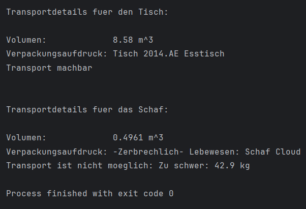

# 2aAPC_A4_Ganea
<a name="readme-top"></a>
# Interface
Author: Ganea Marcus-Alin <br>
LBS Eibiswald | 2aAPC <br>
Erstellt am 16.09.2024

Diese Anwendung ist die vierte Übung von INF...<br>

## Das Ziel der Übung

### Erstelle eine Klasse "Tisch" und "Schaf" von Transportierbar
Füge der Klasse Transport die Methode "berechneVolumen()" hinzu.
Überprüfe ob der Transport machbar ist bzw. berechne das Volumen von Tisch und Schaf.
public interface Transportierbar
{
  float MAX_GEWICHT_PRO_FLAECHE = 29.99f;
 
  // alle Methoden in Interfaces sind implizit public und abstract
  int gewichtKg();
  int laengeCm();
  int breiteCm();
  int hoeheCm();
 
  boolean zerbrechlich();
  boolean stapelbar();
  String beschriftung();
}
 

Ein Interface ist genau dann besonders sinnvoll, wenn es Eigenschaften einer Klasse beschreibt (vorgibt), die nicht direkt in der Vererbungshierachie abgebildet werden können.

Um dieses Merkmal bei unserem Interface Transportierbar optimal zu nutzen, werden wir eine zweite Klasse definieren, welche nicht in die Vererbungshierarchie der Klasse Tisch passt.

Die folgende Klasse Schaf steht der Klasse Tisch aus Vererbungssicht nicht sehr nahe, daher würden sich beide Klassen nur umständlich in einer gemeinsamen Vererbungshierarchie abbilden lassen. Da die Klasse Schaf aber auch über bestimmte Eigenschaften der Klasse Tisch verfügen soll, ist hier die Verwendung eines gemeinsamen Interfaces der richtige Weg.

Das Interface Transportierbar beschreibt dabei für beide implementierenden Klassen die wichtigen Transportdetails, die natürlich noch in jeder der beiden Klassen entsprechend implementiert werden müssen. Das Interface Transportierbar liefert nur die Methodendeklarationen als gemeinsame Schnittstelle.


## Installation

```cmd

git checkout origin/master
```
## oder
```cmd
git clone https://github.com/MarcusGanea/2aAPC_HelloWorld

```
<p align="right">(<a href="#readme-top">back to top</a>)</p>

## Verwendung
Technologien im Einsatz:
[![Java][java.com]][java-url]

## Code Main.Java
```java
public class Main {
    public static void main(String[] args) {
        Tisch myTisch = new Tisch("2014.AE Esstisch", false, 27.3F, 3.0F, 2.2F, 1.3F);
        Schaf mySchaf = new Schaf("Cloud", true, 42.9F, 1.1F, 0.82F, 0.55F);

        System.out.println("\nTransportdetails fuer den Tisch:\n");
        System.out.println("Volumen:             " + InterfaceTest.berechneVolumen(myTisch) + " m^3");
        System.out.println("Verpackungsaufdruck: " + InterfaceTest.erstelleBeschriftung(myTisch));
        if (!InterfaceTest.transportMachbar(myTisch)) {
            System.out.println("Transport ist nicht moeglich: " + InterfaceTest.transportUnmoeglichGrund(myTisch));
        } else {
            System.out.println("Transport machbar");
        }

        System.out.println("\n\nTransportdetails fuer das Schaf:\n");
        System.out.println("Volumen:             " + InterfaceTest.berechneVolumen(mySchaf) + " m^3");
        System.out.println("Verpackungsaufdruck: " + InterfaceTest.erstelleBeschriftung(mySchaf));
        if (!InterfaceTest.transportMachbar(mySchaf)) {
            System.out.println("Transport ist nicht moeglich: " + InterfaceTest.transportUnmoeglichGrund(mySchaf));
        } else {
            System.out.println("Transport machbar");
        }
    }
}

```
<p align="right">(<a href="#readme-top">back to top</a>)</p>

## Screenshots



<p align="right">(<a href="#readme-top">back to top</a>)</p>


<!-- MARKDOWN LINKS & IMAGES -->
<!-- https://www.markdownguide.org/basic-syntax/#reference-style-links -->
[java.com]: https://img.shields.io/badge/Java-ED8B00?style=for-the-badge&logo=openjdk&logoColor=white
[java-url]: https://www.java.com/de/
[product-screenshot]: Screen.png
